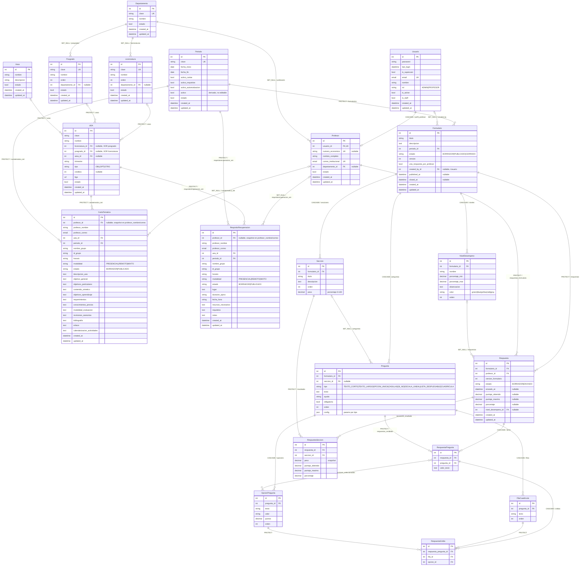

# Diagrama Entidad-Relación — Sistema Proyecto Terminal CyAD

- **Fecha de generación:** 2026-08-11
- **Alcance:** 18 tablas de dominio en 4 apps Django (`accounts`, `catalogos`, `documentos`, `autoevaluacion`).
- **Fuera de alcance:** tablas internas de Django (`auth_*`, `django_session`, `token_blacklist_*`).
- **Fuente:** modelos en `backend/{accounts,catalogos,documentos,autoevaluacion}/models.py`.

## Convenciones

- **PK / FK / UK** identifican clave primaria, foránea y unicidad simple.
- Tipo `datetime`, `date`, `decimal`, `text`, `json`, `email`, `url`, `int`, `bool`, `string` (todos son abstracciones de los tipos Django/PostgreSQL reales).
- Cardinalidad Mermaid:
  - `||--o{` — uno a muchos (FK obligatoria en el hijo).
  - `|o--o{` — cero-o-uno a muchos (FK nullable en el hijo).
  - `||--o|` — uno a uno (relación opcional del lado hijo).
  - `}o--o{` — muchos a muchos.
- La etiqueta de cada relación anota la política **on_delete** del FK (`PROTECT`, `SET_NULL`, `CASCADE`) y, cuando aporta, el `related_name`.
- Los campos heredados de mixins abstractos se replican en cada entidad concreta:
  - `TimeStampedModel` → `created_at`, `updated_at`.
  - `EstadoActivoModel` → `estado` (bool, borrado lógico).
- `DocumentoAcademicoBase` es abstracta y no se representa como entidad; sus campos aparecen en `CartaTematica` y `RequisitoRecuperacion`.

## Diagrama

## Constraints compuestos

Restricciones que no se pueden expresar solo con `UK` en el diagrama:

| Modelo | Tipo | Definición | Motivo |
|---|---|---|---|
| `UEA` | CHECK | `uea_xor_licenciatura_posgrado`: exactamente uno entre `licenciatura` y `posgrado` es no nulo | Una UEA pertenece a una licenciatura **o** a un posgrado, nunca a ambos ni a ninguno |
| `UEA` | UniqueConstraint (parcial) | `uea_clave_unica_por_licenciatura`: `(clave, licenciatura)` cuando `licenciatura` no es nulo | Cada licenciatura no puede tener dos UEA con la misma clave |
| `UEA` | UniqueConstraint (parcial) | `uea_clave_unica_por_posgrado`: `(clave, posgrado)` cuando `posgrado` no es nulo | Análogo para posgrado |
| `Area` | unique_together | `(nombre, descripcion)` | Evita áreas duplicadas |
| `CartaTematica` | UniqueConstraint | `unique_carta_profesor_periodo_uea_grupo`: `(profesor, periodo, uea, id_grupo)` | Un profesor no puede tener dos cartas para el mismo grupo y periodo |
| `RequisitoRecuperacion` | UniqueConstraint | `unique_requisito_profesor_periodo_uea_grupo`: `(profesor, periodo, uea, id_grupo)` | Análogo para requisitos de recuperación |
| `Respuesta` | UniqueConstraint | `unique_respuesta_formulario_profesor_version`: `(formulario, profesor, version_formulario)` | Un profesor responde una sola vez por versión del formulario; al publicar una revisión se incrementa `version` y puede volver a responder |
| `RespuestaPregunta` | unique_together | `(respuesta, pregunta)` | Cada pregunta se contesta a lo más una vez por respuesta |
| `RespuestaCelda` | unique_together | `(respuesta_pregunta, fila)` | Cada fila de cuadrícula tiene una única opción seleccionada |
| `RespuestaSeccion` | unique_together | `(respuesta, seccion)` | Un snapshot por sección al enviar |
| `Periodo` | Regla en `save()` | Solo un `Periodo` puede tener `activo_cartas=True`, otro con `activo_requisitos=True`, otro con `activo_autoevaluacion=True`. El campo `activo` es OR derivado | Independiza el ciclo por recurso (Cartas del trimestre N+1, Requisitos/Autoeval del N) |

## Notas de comportamiento clave

- **Snapshot histórico de profesor** (documentos): `profesor_id` es `SET_NULL`; al eliminar al profesor, `profesor_nombre` y `profesor_correo` conservan quién era el autor. Por eso los documentos sobreviven al ciclo de vida del `Profesor`.
- **Versionado de formularios**: `Respuesta.version_formulario` congela la versión del `Formulario` respondida. Publicar una revisión (`publicar_revision`) incrementa `Formulario.version`; los profesores ven el formulario como pendiente porque su última respuesta apunta a una versión anterior. Las respuestas viejas se conservan como historial.
- **Snapshot de pesos** en `RespuestaSeccion.peso`: se copia desde `Seccion.peso` al enviar para que el desglose histórico permanezca estable aunque el admin ajuste pesos y republique.
- **Estados de documento** (`DocumentoAcademicoBase.Estado`): solo se puede editar/eliminar en `BORRADOR`; publicar bloquea la edición hasta despublicar.
